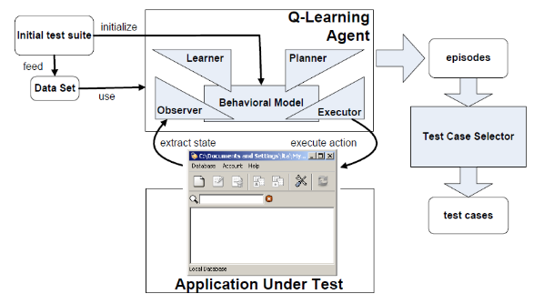
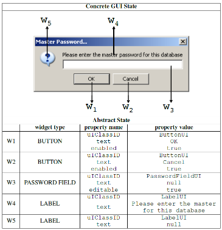
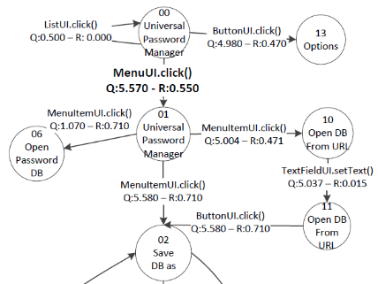
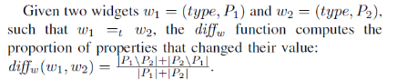
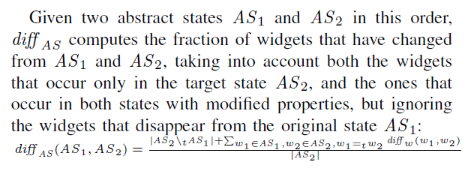
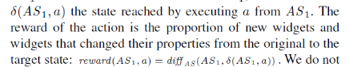

# Automatic testing of GUI-based applications

* Special Issue: ICST 2012, the Fifth IEEE International Conference on Software Testing, Verification and Validation

* Paper : [AutoBlackTest_Automatic_BlackBox_Testing20160208-26582-yhb1y3.pdf](../resources/AutoBlackTest_Automatic_BlackBox_Testing20160208-26582-yhb1y3.pdf)

## Key Word

* Q-Learning, GUI Test Automation, Robustness Testing

## Summary

* Q-Learning 기반 GUI 테스트 자동화 시스템 구축을 위한 구조의 세부 설명이 군더더기 없이 깔끔함

* Q-Learning 알고리즘을 GUI 테스트 자동화 도구에 적용하기 위해 필요한 사항을 자세히 설명하고 있음

* 학습 과정 이전에 초기 테스트 정보를 제공하는 것이 특징적임 (다만, 이것의 비용은 사용자에게 전가함)

* 때로는 초기 정보로 특정 화면 구조에서의 action sequence 를 사전 정의해 놓기도 함 (물론 없이도 수행 가능하다 하지만)

* Q-Learning 알고리즘 구조와 제안되는 구조 간의 개념적 불일치가 다소 있으나 이해에 무리가 없음

## AutoBlackTest : Q-Learning 기반 GUI 테스트 자동화 도구의 구조

   

#### A. Observer : 상태의 표현

  * 테스트 대상 어플리케이션의 상태 획득하고 이를 추상화

    

  * 상태 추상화 과정에서 추상 식별자가 실제 응용 상태와 1:1 이 아닌 1:N 관계가 될 수 있으나
    이는 agent 가 수행할 action 이 동일하다면 문제되지 않는다 주장함

  * 상태의 표현과는 별개로 widget 인스턴스를 고유하게 식별할 수 있는 특성치(trait)를 추출.
    이를 통해 widget 인스턴스 (e.g., dialogs) 의 중복 출현의 판단이 가능 (exploration & exploitation 관점)

#### B. Learner and Behavioral Model : 새로운 상태 탐색에 보상을 주고 있음

  * Agent 가 action 을 수행해 상태가 변경되는 시점에 Learner 는 Behaviroal Model 을 구축

  * Behavioral 은 (State, Action, Reward 값, Q 값) 로 그래프 형태로 구성

    

  * reward function 은 Widget 간 Property 변경 개수의 차이를 주축으로 상태의 차이를 정량화

    

    * 위 식을 가지고 reward 함수 정의

      

      

#### C. Planner : e-greedy & softmax policy 사용

 * Planner 는 Action 을 선택하기 위한 정책을 갖고 있음

   * 신규 상태 탐사 정책 : 실험적으로 계수도 여러개 넣어가면서 해보았다는데 결국은 e-greedy 가 제일 잘나온다고 함

     * [참고] e-greedy : exploration 을 위해 Q 에 램덤성 부여

   * 랜덤 특징 보완 정책 : "여러 개의 입력 폼을 갖는 widget 이 나타나면 fill in 하고 버튼을 클릭해라"

     * 이것을 complex action 으로 포장하고 있고 이 종류에는 File Chooser, Color Chooser, Fill Form, HandleList 등이 있음

     * 랜덤에 맞겨 두면 필수 입력 폼을 모두 채워서 테스트 하는 action sequence 를 언제 만들어 낼지 모르니 그러는 것 같음

#### D. Executor : action 실행

## 탐지 가능한 결함

* Crash, Hangs, Uncaught Exception