# Guided, Stochastic Model-Based GUI Testing of Android Apps

① ESEC/FSE 2017 Proceedings of the 2017 11th Joint Meeting on Foundations of Software Engineering

   * [fse17-stoat-full-paper.pdf](../resources/fse17-stoat-full-paper.pdf)

   * https://github.com/tingsu/Stoat

② https://www.youtube.com/watch?v=Y1bTgqRwtbQ

  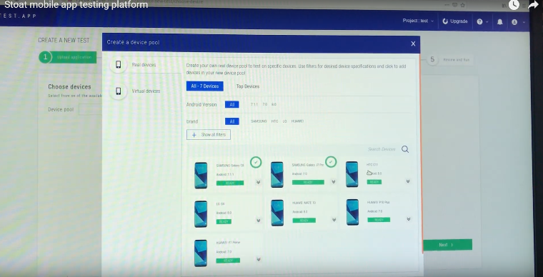

  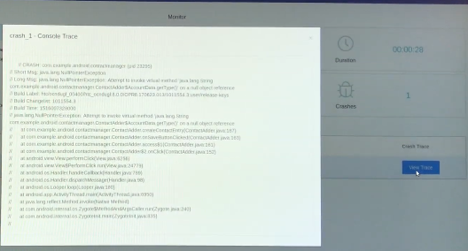

   * https://sites.google.com/site/stoat2017/demo

## KeyWord

Sampling Based M/L, Gibbs Sampling, GUI Test Automation, Android App

## Summary

① 어플리케이션 상태 변화를 가중치 그래프 구조의 행위 모델로 표현, node 는 UI Widget 의 상태로 edge 는 방문 빈도로 정의

② 도구 수행은 1) 초기 모델 구축 단계와 2) 모델 뮤테이션 단계로 구성되고 단계-2 에서 Test Sequence 생성 및 수행

 단계-1 에서는 정적 분석을 통해 어플리케이션 별로 의미있는 사용자 이벤트 집합과 관심 이벤트 집합을 도출하는 것,

  그리고 단계-1 의 정적 분석을 통해 추출한 시스템 이벤트를 임의로 주입해주는 것이 특징 중 하나

③ SOTA 였던 [Facebook Sapienz](../resources/p_issta16_sapienz.pdf) 을 Crash Uniqueness 와 Code Coverage 기준으로 추월

  * 이들 GUI 테스트 자동화 영역은 Unique Crash (#), Code Coverage 기준을 가지고 대결 中

  * Sapienz 이전에는 학계에서 조차도 Monkey Test 가 최고라고 여겨졌었음

④ 강화 학습의 구조와 매우 유사한 구조와 알고리즘을 가지고 있음. *Stoat 것을 벤치마킹해서 강화학습으로 변경해서 개선한다면?*

  * learning : model construction phase

  * model + Q function = application model

  * policy = gib sampling , reward = objective function

## Limitation

① 실행 불가능한 이벤트 시퀀스를 생성하기도 하는데, 제안된 방법만으로 이를 해결할 수 없어 turn-around 로 UI object index 를 가지고
   이벤트 주입 대상 UI object 를 찾아감

② 당연한 것이겠지만 모든 가능한 상태를 탐색하도록 할 수 없음

## Overall Approach

#### [Phase - 1 Model Construction : FSM 형태로 앱 state 와 behavior 를 표현]

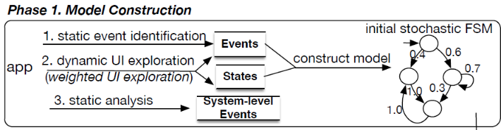

**① 목적** : 초기 행위 모델 (모델 = @ 2nd phase , test sequence 생성을 가이드하는데 사용) 구축

* Static Analysis : 소스 코드의 이벤트 리스너를 보고 특정 상태에서 입력 가능 이벤트 (시스템 이벤트 포함) 집합 추출
* Dynamic Analysis
   * UI 의 계층 구조를 보고 입력할 이벤트 추론
   * 코드 커버리지 최대화를 위한 이벤트 수행의 우선순위 책정
* Exploration : FSM 구축하는 동안 이벤트 수행 빈도를 저장, 초기 모델 확정(transition probability)에 사용됨

#### [Phase - 2 Model Mutation : Test Sequence 생성 및 수행]

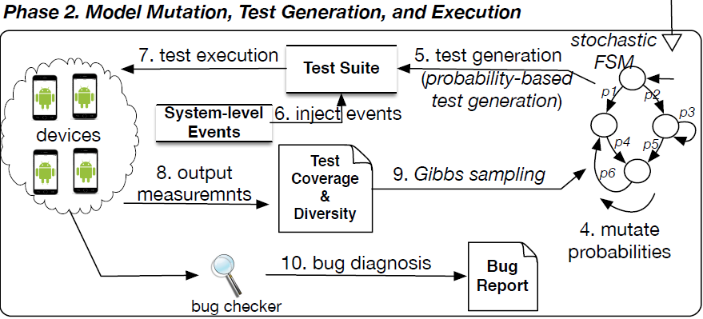

**① 목적** : Code Coverage 와 Event Sequence Diversity 의 최대화

* "Exploration" 성향 높이기 위해 transition probability 의 mutation
* mutation 모델을 활용해 test sequence 생성 + system event(phase-1 추출) 랜덤 주입
* event sequence 수행 및 code coverage / seq diversity 계산
* gibbs sampling 통해 수행 결과를 보고 mutated model 을 새로운 model 로 정의할 것인지 결정

## Stochastic Finite State Model

#### 구성 요소
상태 집합(초기 상태, 최종 상태 포함), 입력 이벤트 집합, 전이 확률

#### 단위 상태의 정의

**① 목적** : State Explosion 문제와 Diversity 문제의 적정선을 찾고자 하는 것임

* 단위 상태 표현

  UI Layout 에 포함되는 실행 가능하는 Widget Component 들의 계층 구조를 상태로 함

  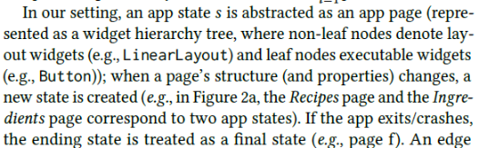

  아래와 같은 Tree 를 하나의 상태로 표현.

  [Android Layout Inspector ](https://developer.android.com/studio/debug/layout-inspector) 가 제공하는 정보 수준으로 판단됨

  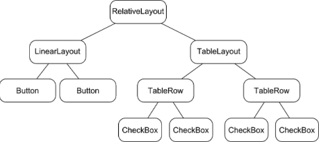

  즉, 구조적 정보만으로 상태를 정의하고 UI 정보(체크 박스의 체크 상태, TextView 의 text 변경 등)은 정의에 고려하지 않음.
  다만, ListView 의 경우 empty, non-empty 만을 고려함

* 초기 상태 : 앱 구동 상태

* 최종 상태 : app exit, enter into other app, crash , not responding

#### 확률 전이 함수

최초 전이 확률은 Model Construction 단계에서의 "대상 이벤트 실행 횟수 / 전체 이벤트 실행 횟수" 정의됨

## Details on "Model Construction" phase

#### Static Event Identification

**① 목적** : 안드로이드 F/W 이 제공하는 static UI information 에는 동적 이벤트 정보가 누락되어 이를 보완하고자 함

* android.app.Activity 별로 menu action 은 menu key 눌려져야 호출 가능함. 즉, 이벤트 핸들러가 구현된 앱에 대해서만 해당 이벤트를 발생하면 됨

  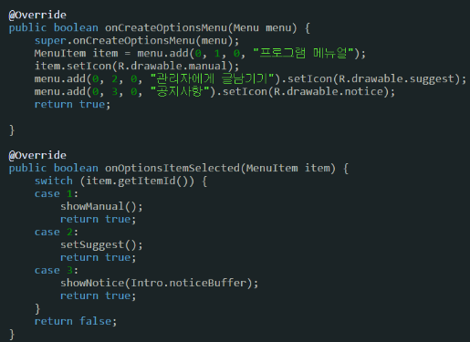

* Text View 의 Long Click 처리. 이런 이벤트는 동적으로 만들어짐

   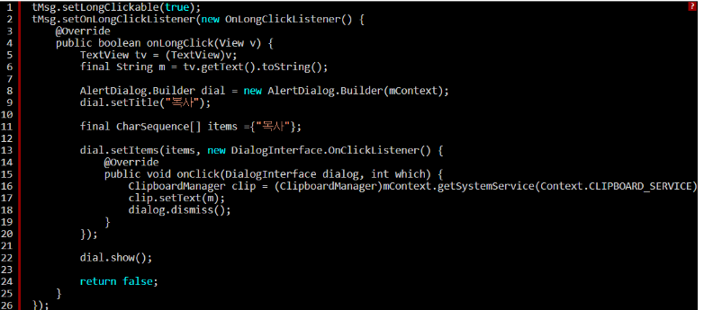

* 즉, Button 과 같은 것이 UI 에 표현되었으면 당연히 이벤트 핸들러가 있을 것인데, 위 두 예제 같은 것은 앱별로 case by case 이니
  무조건 있다고 가정하고 이벤트를 주입시키는 것은 효율성을 떨어 트릴테니 당연한 것과 그렇지 않는 것을 구분하고
  그렇지 않은 것은 static 코드 분석을 통해 선별한다는 것으로 이해됨

**② 방법** : 이벤트 리스너와 특정 overriding 된 method 들에서 이벤트 추출, 동적 탐색 時 이벤트 주입시 얻어오는 UI 의 resource id 에 연관시킴

**QUESTION** : state 와 무관하게 연관 정보를 별도 관리한다는 의미인지? 구체 사항이 궁금함

#### UI Exploration Strategy

**목적** : 대상 앱의 행위를 최대한 완전(completeness)하게 빠짐없이 표현해내기 위함

**방법** : 4 가지 탐색 전략을 경험적으로 도출

| 전략                 | 설명 |
|:---------------------|:-----|
| 이벤트 수행 빈도      | 수행 빈도가 낮은 이벤트가 후속 탐색 과정에서 선택되어 지는 경우가 많더라..    |
| 이벤트 유형          | 탐색 효율성을 높이기 위해서는 Menu, Back, Scroll 이벤트는 일반적인 Click 등의 이벤트와 달리 특정 시점을 고려해서 seq 에 포함해야 하더라.     |
| 미방문 자식 노드의 수 | 어떤 이벤트로 인해 새로운 UI widget 들을 많이 발견하게 된다면 이 이벤트는 우선순위를 다른 이벤트와 달리 정의해야 하더라      |

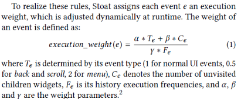

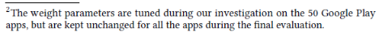

QUESTION : unvisited 는 ui widget 의 식별자 (e.g., object id) 로 판단하는가? 상태의 다름으로 판단하는가?

#### Algorithm Summary

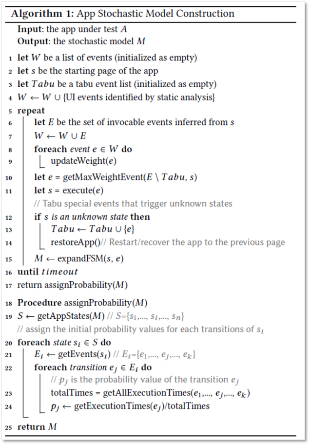

## Details on the "Model Mutation" phase

#### Gibbs Sampling

**① 정의** : 깁스 샘플링은 Markov Chain Monte Carlro 의 일종으로 두 개 이상의 확률변수의 결합확률분포로부터 일련의 표본을 생성하는 확률적 알고리즘

* Monte Carlo :  랜덤 표본을 뽑아 함수의 근사해를 확률적으로 계산하는 알고리즘
* Markov Chain : 코프 연쇄(Markov Chain)란 마코프 가정(Markov assumption)을 따르는 이산 시간 확률 과정으로
                 한 상태에서 다른 상태로의 전이(transition)는 그동안 상태 전이에 대한 긴 이력(history)을 필요로 하지 않고 바로 직전 상태에서의 전이로 추정
* MCMC : Markov Chain Based Monte Carlo

**② 응용** : Stoat 관점에서는 특정 App State 상태에서 입력 가능한 event 들의 transition probability 들을 의미하고
       특정 상태에서 복수의 transition 으로 동시에 갈 수 없기 때문에 Gibbs Sampling 적용이 적합함

**③ 특징** : 깁스 샘플링은 다음번 생성될 표본은 현재 샘플에 영향을 받는다는 점에서는 MCMC 와 같지만,
       나머지 변수는 그대로 두고 한 변수에만 변화를 준다는 점이 다릅니다.

**④ 확률 밀도 함수化** : 목적 함수(cost function)을 확률 밀도 함수로 변환하는 일반적 방법 ,refs to 3.2 @ [Stochastic Superoptimization.pdf](../resources/Stochastic%20Superoptimization.pdf)

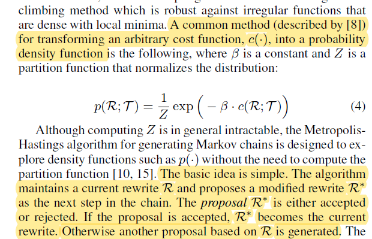

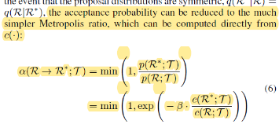

**⑤ 알고리즘 상세**

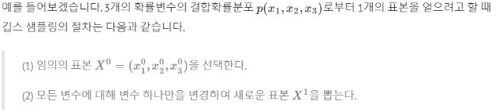

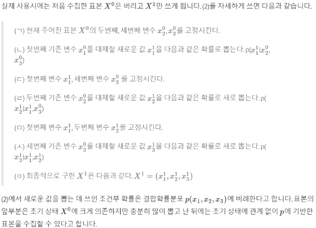

#### 확률 기본 개념

http://wolfpack.hnu.ac.kr/2015_Fall/IS/%ED%86%B5%EA%B3%84%ED%95%99%EC%9B%90%EB%A1%A0_4%EC%9E%A5.pdf