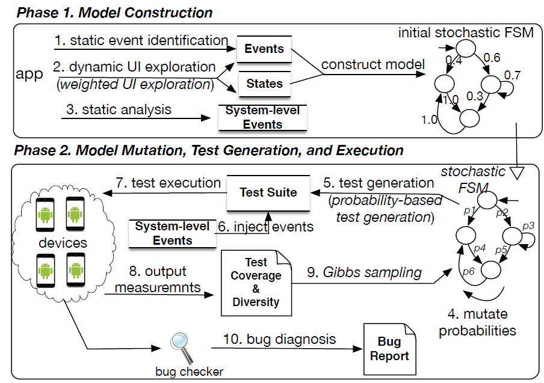

# Guided, Stochastic Model-Based GUI Testing of Android Apps

* ESEC/FSE 2017 Proceedings of the 2017 11th Joint Meeting on Foundations of Software Engineering

* [fse17-stoat-full-paper.pdf](../resources/fse17-stoat-full-paper.pdf)

* https://github.com/tingsu/Stoat

* https://www.youtube.com/watch?v=Y1bTgqRwtbQ

  

  

* https://sites.google.com/site/stoat2017/demo

## KeyWord

* Stochastic Behavior Model, GUI Testing

## Summary

* 어플리케이션 상태 변화를 가중치 그래프 구조의 행위 모델로 표현, node 는 UI Widget 의 상태로 edge 는 방문 빈도로 정의

* 도구 수행은 1) 초기 모델 구축 단계와 2) 모델 뮤테이션 단계로 구성되고 단계-2 에서 Test Sequence 생성 및 수행

* 단계-1 에서는 정적 분석을 통해 어플리케이션 별로 의미있는 사용자 이벤트 집합과 관심 이벤트 집합을 도출하는 것,

  그리고 단계-1 의 정적 분석을 통해 추출한 시스템 이벤트를 임의로 주입해주는 것이 특징 중 하나

* SOTA 였던 [Facebook Sapienz](../resources/p_issta16_sapienz.pdf) 을 Crash Uniqueness 와 Code Coverage 기준으로 추월

  * 이들 GUI 테스트 자동화 영역은 Unique Crash (#), Code Coverage 기준을 가지고 대결 中

  * Sapienz 이전에는 학계에서 조차도 Monkey Test 가 최고라고 여겨졌었음

* 강화 학습의 구조와 매우 유사한 구조와 알고리즘을 가지고 있음. *Stoat 것을 벤치마킹해서 강화학습으로 변경해서 개선한다면?*

  * learning : model construction phase

  * model + Q function = application model

  * policy = gib sampling , reward = objective function

## Limitation

* 실행 불가능한 이벤트 시퀀스를 생성하기도 하는데, turn-around 로 UI object index 를 가지고
   이벤트 주입 대상 UI object 를 찾아감 (왜 한계점이라고 했는가?)

* 모든 가능한 상태를 찾아가지는 못함 (이것도 당연한 한계점이 아닌가? 왜 이렇게 말하는가?)

## Overall Approach

### Phase - 1 : Model Construction

* 모델 = 앱 상태 , 입력 이벤트, 전이 함수, 초기 상태, 종료 상태

  * 앱 상태 표현 :

### Phase - 2 : Model Mutation